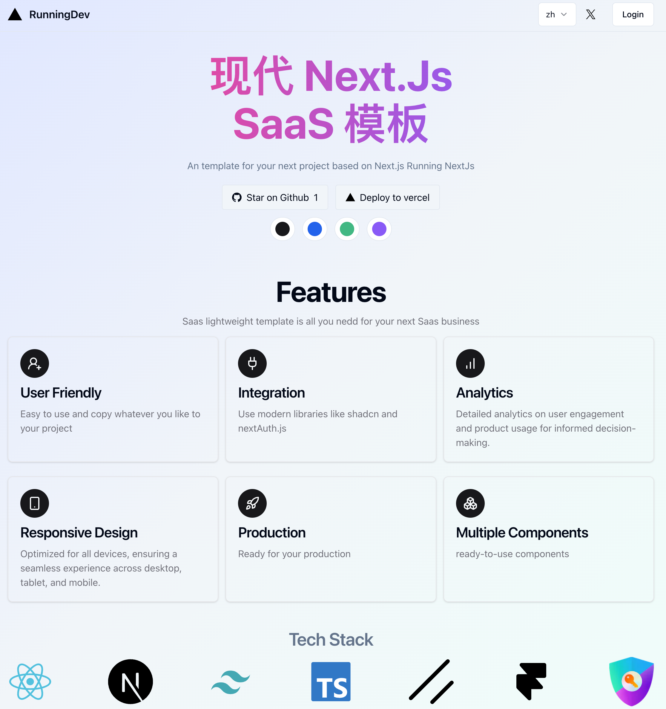

<div align="center">
  <h1>RunningDev</h1>

  <p>🌏 现代化的NextJs网页开发模板 🌏</p>
   
   [English](./README-en.md)
</div>

<div align="center">
    
   
  
  
  
</div>

---



## 特点

- 🌟基于最流行的技术栈:
  - [shadcn](https://ui.shadcn.com/): 是去年star增长数最多的技术栈, 因为其友好的样式以及基于 [tailwindcss](https://www.tailwindcss.cn/) 的样式二次开发
  - [Nextauth](https://next-auth.js.org/): 方便集成第三方登录、密码登录等常见登录功能
- 🌐i18n支持: 基于[next-intl](https://github.com/amannn/next-intl), 友好的支持国际化, **服务端/客户端**均给出示例, 可以方便的进行多流量设置
- 🚀oauth支持: 基于[Nextauth](https://next-auth.js.org/) 的登录模板, 目前实现了基于 google 和 github 的oauth 登录,详细配置见 [这里](#环境变量)

## RoadMap

- [ ] 集成Lemon Squeezy
- [ ] NextAuth
  - [ ] 登录
  - [ ] 注册

## 本地部署

克隆该项目后, 参考`.env.example`创建`.env`文件, 并参考下面的[配置文档](#环境变量) 配置开发环境的环境变量

```shell
npm i
npm run dev
```

> [!IMPORTANT]
> 开发环境和线上环境的配置是不一样的,需要注意

## 部署

可以方便的一键部署到 [vercel](https://vercel.com/) 看效果
[](https://vercel.com/new/clone?repository-url=https%3A%2F%2Fgithub.com%2Ftonyljx%2Fsaas-lightweight-template&env=GITHUB_APP_CLIENT_ID,GITHUB_APP_CLIENT_SECRET,GOOGLE_APP_CLIENT_ID,GOOGLE_CLIENT_SECRET,NEXTAUTH_SECRET)

## 配置

### 颜色配置

因为UI采取shadcn, 所以颜色配色方案可以参考 [shadcn](https://ui.shadcn.com/themes)

### 环境变量

#### GITHUB: 配置oauth登录

1. 打开 [github oauth apps ](https://github.com/settings/developers) 页面
2. 点击 new Oauth App, 创建应用
   1. Application name: 写和本次应用相关的name, 无强制要求
   2. Homepage url：开发的时候写本次URL, 部署到线上需要写线上域名
   3. Authorization callback url: 开发的时候写本地回调url [http://localhost:3000/api/auth/callback/github](http://localhost:3000/api/auth/callback/github)，部署线上应用需要写线上版本的url: [https://hostname/api/auth/callback/github](https://hostname/api/auth/callback/github)

#### GOOGLE：配置oauth登录

和github基本同理,注意有几点不同

- callback url的不同
- google oauth url不同: 参考[https://developers.google.com/identity/protocols/oauth2/javascript-implicit-flow?hl=zh-cn](https://developers.google.com/identity/protocols/oauth2/javascript-implicit-flow?hl=zh-cn)

## 👀关于我

- [X / Twitter](https://twitter.com/abc30037274)

## ✨学习文档

- shadcn 官方库: [shadcn/ui](https://ui.shadcn.com/)
- google 官方基础 web 课程（html/css): [web.dev](https://web.dev/learn/)
- react 官方文档 (有基础的直接看文档) : [React](https://react.dev/)
- nextjs 官方网站，有丰富的参考文档：[Next.js by Vercel - The React Framework (nextjs.org)](https://nextjs.org/)
- nextjs 官方课程，以项目为导向学习 nextjs：[Learn Next.js | Next.js by Vercel - The React Framework (nextjs.org)](https://nextjs.org/learn?utm_source=next-site&utm_medium=homepage-cta&utm_campaign=home)
- tailwindcss 样式库：[安装 - TailwindCSS中文文档 | TailwindCSS中文网](https://www.tailwindcss.cn/docs/installation)
- 设计相关
  - 渐变颜色： [CSS Gradient — Generator, Maker, and Background](https://cssgradient.io/)
  - icon：[Lucide | Lucide](https://lucide.dev/icons/)

## Star History

[](https://star-history.com/#tonyljx/saas-lightweight-template&Date)
